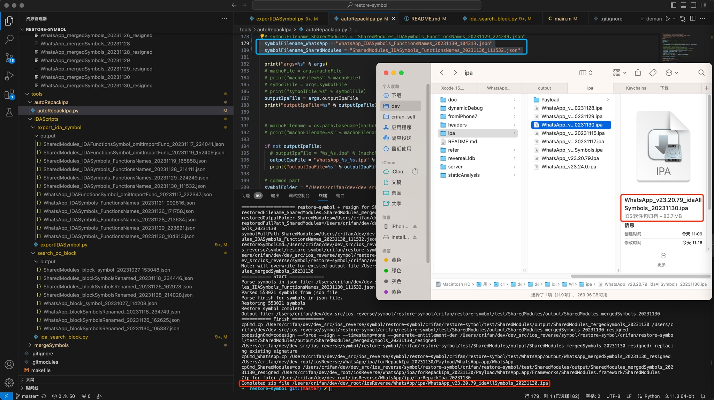

# AutoRepackIpa

* Update: `20231205`

Python script to automate the whole process for repack ipa file:

* (1) unzip origin ipa
* (2) do restore-symbol for Mach-O file
* (3) do resign for Mach-O file
* (4) replace to new resigned Mach-O file
* (5) zip whole folder to ipa file

## Usage

* run `autoRepackIpa.py`
  * to auto do all steps for your
    * (1) call `restore-symbol` to restore symbols
    * (2) call `codesign` to resign
    * (3) `unzip` original ipa
    * (4) `replace` to new resigned mach-o file
    * (5) `zip` folder to ipa file
  * Example
    * WhatsApp
      * 
  * Attention
    * before use it, you need to edit to chagne to **your** `mach-o file` and `related paths`

## TODO

* [ ] after shell run IDA export symbol, add to here, then all step can automate do it
* [ ] uninstall app in iPhone, then reinstall new ipa to iPhone
