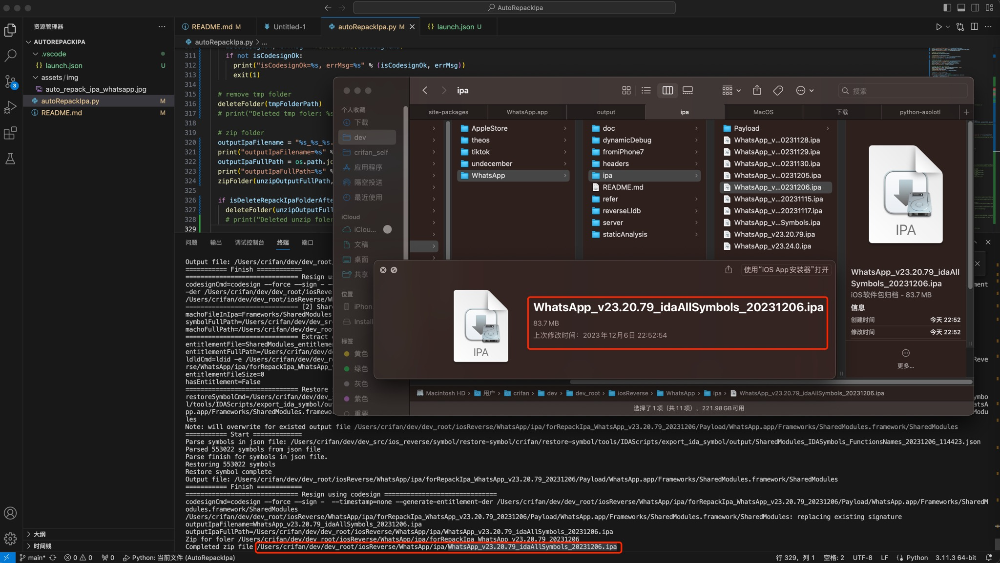

# AutoRepackIpa

* Update: `20240124`

Python script to automate the whole process for repack ipa file:

* (1) Unzip origin ipa
* (2) Extract entitlement using ldid
  * [x] auto edit entitlement file to make app debuggable
* (3) Restore symbol using restore-symbol
* (4) Resign using codesign
* (5) Zip whole folder to ipa file

## Usage

### Example

#### WhatsApp

* designate restore-symbol
  ```bash
  python autoRepackIpa.py -i /Users/crifan/dev/dev_root/iosReverse/WhatsApp/ipa/WhatsApp_v23.20.79.ipa --restore-symbol=/Users/crifan/dev/dev_src/ios_reverse/symbol/restore-symbol/crifan/restore-symbol/restore-symbol --symbol-list=WhatsApp=/Users/crifan/dev/dev_src/ios_reverse/symbol/restore-symbol/crifan/restore-symbol/tools/IDAScripts/export_ida_symbol/output/WhatsApp_IDASymbols_FunctionsNames_20231206_114323.json --symbol-list=Frameworks/SharedModules.framework/SharedModules=/Users/crifan/dev/dev_src/ios_reverse/symbol/restore-symbol/crifan/restore-symbol/tools/IDAScripts/export_ida_symbol/output/SharedModules_IDASymbols_FunctionsNames_20231206_114423.json
  ```
  * `-i /Users/crifan/dev/dev_root/iosReverse/WhatsApp/ipa/WhatsApp_v23.20.79.ipa`
    * input ipa file
  * `--restore-symbol=/Users/crifan/dev/dev_src/ios_reverse/symbol/restore-symbol/crifan/restore-symbol/restore-symbol`
    * restore-symbol executable file
  * `--symbol-list=WhatsApp=/Users/crifan/dev/dev_src/ios_reverse/symbol/restore-symbol/crifan/restore-symbol/tools/IDAScripts/export_ida_symbol/output/WhatsApp_IDASymbols_FunctionsNames_20231206_114323.json`
    * machoFileInIpa=`WhatsApp`
    * JsonSymbolFile=`/Users/crifan/dev/dev_src/ios_reverse/symbol/restore-symbol/crifan/restore-symbol/tools/IDAScripts/export_ida_symbol/output/WhatsApp_IDASymbols_FunctionsNames_20231206_114323.json`
  * `--symbol-list=Frameworks/SharedModules.framework/SharedModules=/Users/crifan/dev/dev_src/ios_reverse/symbol/restore-symbol/crifan/restore-symbol/tools/IDAScripts/export_ida_symbol/output/SharedModules_IDASymbols_FunctionsNames_20231206_114423.json`
    * machoFileInIpa=`Frameworks/SharedModules.framework/SharedModules`
    * JsonSymbolFile=`/Users/crifan/dev/dev_src/ios_reverse/symbol/restore-symbol/crifan/restore-symbol/tools/IDAScripts/export_ida_symbol/output/SharedModules_IDASymbols_FunctionsNames_20231206_114423.json`
* output
  * `WhatsApp_v23.20.79_idaAllSymbols_20231206.ipa`
    * 
* use default restore-symbol
  ```bash
  python autoRepackIpa.py -i /Users/crifan/dev/dev_root/iosReverse/WhatsApp/ipa/WhatsApp_v23.20.79.ipa --symbol-list=WhatsApp=/Users/crifan/dev/dev_root/crifan/github/restore-symbol/tools/IDAScripts/export_ida_symbol/output/WhatsApp_IDASymbols_FunctionsNames_20231211_094245.json --symbol-list=Frameworks/SharedModules.framework/SharedModules=/Users/crifan/dev/dev_root/crifan/github/restore-symbol/tools/IDAScripts/export_ida_symbol/output/SharedModules_IDASymbols_FunctionsNames_20231211_094419.json

  python autoRepackIpa.py -i /Users/crifan/dev/dev_root/iosReverse/WhatsApp/WhatsApp_v23.25.85/ipa/WhatsApp_v23.25.85.ipa --symbol-list=WhatsApp=/Users/crifan/dev/dev_root/crifan/github/restore-symbol/tools/IDAScripts/export_ida_symbol/output/WhatsApp_IDASymbols_FunctionsNames_20240124_144411.json --symbol-list=Frameworks/SharedModules.framework/SharedModules=/Users/crifan/dev/dev_root/crifan/github/restore-symbol/tools/IDAScripts/export_ida_symbol/output/SharedModules_IDASymbols_FunctionsNames_20240124_144522.json
  ```

## Help syntax

```bash
➜  AutoRepackIpa git:(main) ✗ python autoRepackIpa.py --help
curDateStr=20231206
usage: autoRepackIpa.py [-h] -i INPUTIPAFILE [-o OUTPUTIPAFILE] [-r RESTORESYMBOL] [-l SYMBOLLIST [SYMBOLLIST ...]]

options:
  -h, --help            show this help message and exit
  -i INPUTIPAFILE, --input-ipa-file INPUTIPAFILE
                        Input IPA file full path
  -o OUTPUTIPAFILE, --output-ipa-file OUTPUTIPAFILE
                        Output repacked IPA file
  -r RESTORESYMBOL, --restore-symbol RESTORESYMBOL
                        restore-symbol exectuable full path. Default: restore-symbol
  -l SYMBOLLIST [SYMBOLLIST ...], --symbol-list SYMBOLLIST [SYMBOLLIST ...]
                        Symbol list restore, support multiple item to to list, single item format: {machoFileInIpa}={JsonSymbolFile}
```

## TODO

* [ ] add more arg: `-b`=`--enable-restore-objc-symbol`, while pass in: "--symbol-list=WhatsApp=" or "--symbol-list=Frameworks/SharedModules.framework/SharedModules=" for no json symbol file
* [ ] after shell run IDA export symbol, add to here, then all step can automate do it
* [ ] uninstall app in iPhone, then reinstall new ipa to iPhone
